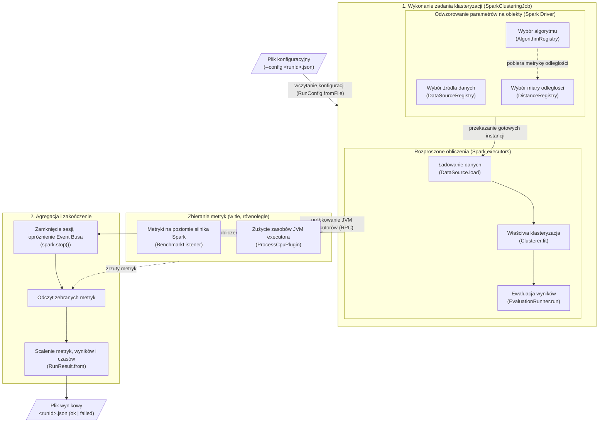

# spark-clustering-algorithms

Part of the Master thesis 'Performance and efficiency issues of the use of Big Data frameworks for implementation of clustering algorithms'.

## Table of contents
* [General info](#general-info)
* [Architecture](#architecture)
* [Project structure](#project-structure)
* [Requirements](#requirements)
* [Usage](#usage)
* [Contract](#contract)


## General info

From-scratch **Scala / Spark** implementations of clustering algorithms, plus the
Spark side of the benchmarking framework. Builds a self-contained fat jar that runs
**one config in, one result out**.

This repo owns only the algorithms and the Spark job. Experiment orchestration (matrix
expansion, SLURM submission), the exchange **contract**, and result analysis are
engine-agnostic and live in the shared repo: [`clustering-algorithms-benchmark`](https://github.com/natix-x/clustering-algorithms-benchmark).

> **Note:** Some documentation and diagrams are in Polish, as the master thesis they accompany is written in Polish.

Implemented algorithms:
TODO: ADD DESCRIPTIONS/DIAGRAMS/WHAT CAN BE CONFIGURED HERE


## Architecture

`BenchmarkRunner` consumes exactly one per-run JSON config and produces exactly one JSON
result file under `<outputDir>/<runId>.json`. Failure modes still write a result
(`status: "failed"` + `errorMessage`) and exit non-zero, so SLURM array jobs never
silently lose runs.



The pipeline is assembled from config strings by three registries, so adding an
algorithm, data source, or metric is one factory entry — the runner never changes:

- **`AlgorithmRegistry`** — `config.algorithm.name` → `Clusterer` factory.
- **`DataSourceRegistry`** — `config.dataset.type` → `DataSource` factory (synthetic / Parquet).
- **`DistanceRegistry`** — `params.distance` → `DistanceMetric` (Euclidean / Manhattan / Cosine).

Core abstractions (`clustering.core`) keep algorithms uniform:

- `Clusterer.fit(DataFrame): Model` — the fitting seam every algorithm implements.
- `Model.assignClusters(DataFrame): DataFrame` — adds a `Columns.Prediction` column with
  each row's cluster id. Batch-only by design: some models (e.g. DBSCAN) have no
  meaningful per-point predict, so single-point prediction is not part of the contract.

`SparkClusteringJob` wires these together for one run: load the `DataSource`, `fit` the
`Clusterer`, evaluate the `Model`, and collect metrics into a `RunResult`.

## Project structure
```
.
├── spark/                        # Scala/Spark SBT project (the fat jar)
│   ├── build.sbt                 # Scala/Spark build, assembly into a fat jar
│   ├── src/main/scala/clustering/
│   │   ├── core/                 # Clusterer / Model abstractions
│   │   ├── algorithms/           # clustering algorithms implementations
│   │   ├── distance/             # Euclidean / Manhattan / Cosine metrics
│   │   ├── evaluation/           # clustering metrics
│   │   ├── utils/                # convergence checks
│   │   └── benchmark/            # runner (--config) + config, datasource, evaluation, metrics, registry
│   └── ...
├── local_run.sh                  # spark-submit a single run locally
├── local_testing/                # JSON configs for local single-run testing
└── benchmark-results/            # local run outputs (one JSON result per run)
```

## Requirements

* JDK 11
* Scala 2.12 / sbt (with `sbt-assembly`)
* Apache Spark 3.3.2 (Hadoop 3)

## Usage

Build the fat jar:
```bash
cd spark
sbt assembly        # -> target/scala-2.12/spark-clustering-benchmark.jar
```

Run a single benchmark locally (from repo root):
```bash
./local_run.sh local_testing/experiment_configs/example.json
```

`local_run.sh` submits one config in `local` mode and writes the result to
`benchmark-results/`. Each config (dataset, algorithm, evaluation, Spark conf) conforms
to `run_config.schema.json` in the harness repo.

## Contract

The JSON exchanged between the repos is defined by
[`contract/README.md`](https://github.com/natix-x/clustering-algorithms-benchmark/blob/main/contract/README.md)
in the harness repo. This jar **consumes** `run_config.schema.json` (via
`--config <runId>.json`) and **produces** `run_result.schema.json`, so analysis is
uniform across engines.

Conformance is verified by a test, not at runtime. `SparkClusteringJobContractSpec`
runs a real `SparkClusteringJob` on a tiny synthetic dataset and asserts that the
emitted `RunResult` validates against the vendored `run_result.schema.json`
(`spark/src/test/resources/`). It covers both an `ok` run and a `failed` run
(unknown algorithm), and because the schema is `additionalProperties: false`, any
Scala field not declared in the contract makes the test fail — guarding against
schema drift.

```bash
cd spark
sbt "testOnly clustering.benchmark.SparkClusteringJobContractSpec"
```
